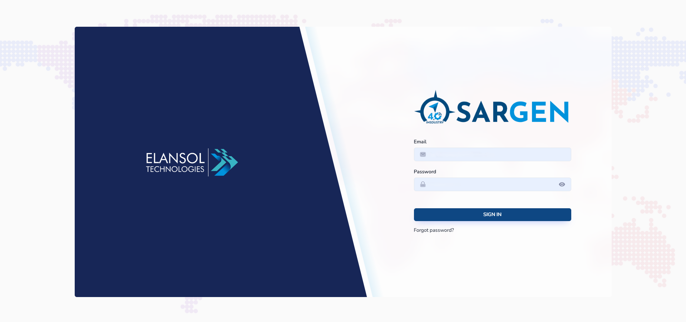
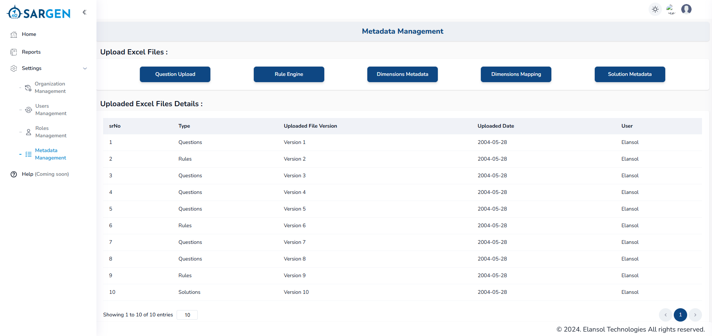
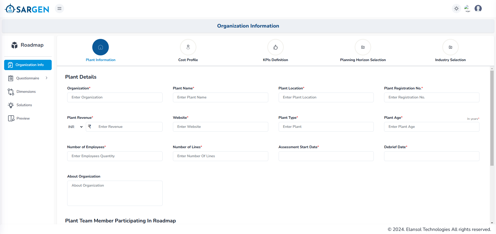
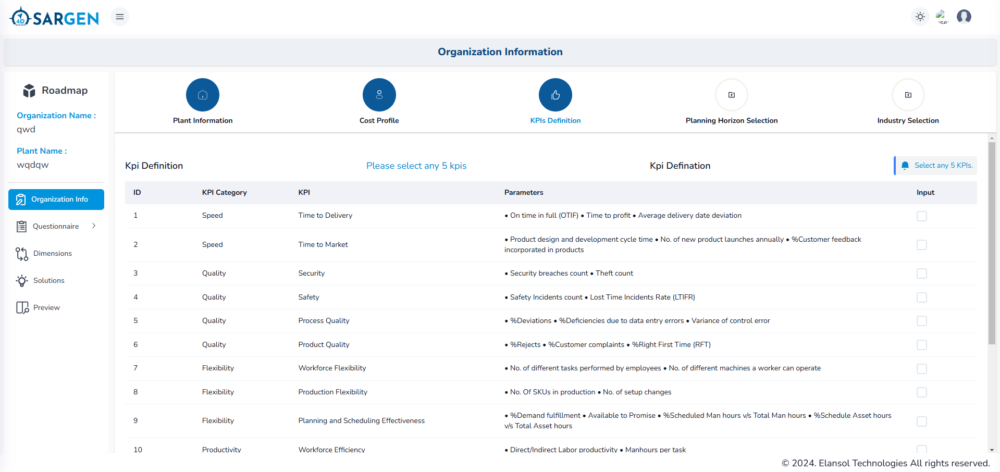
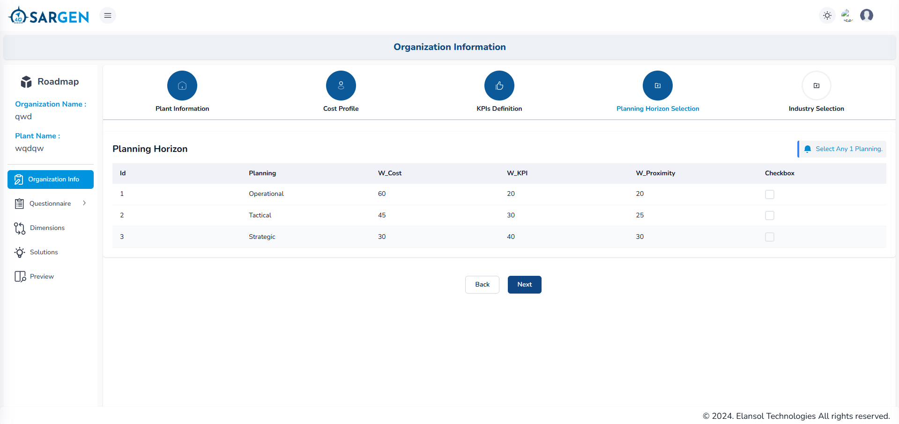
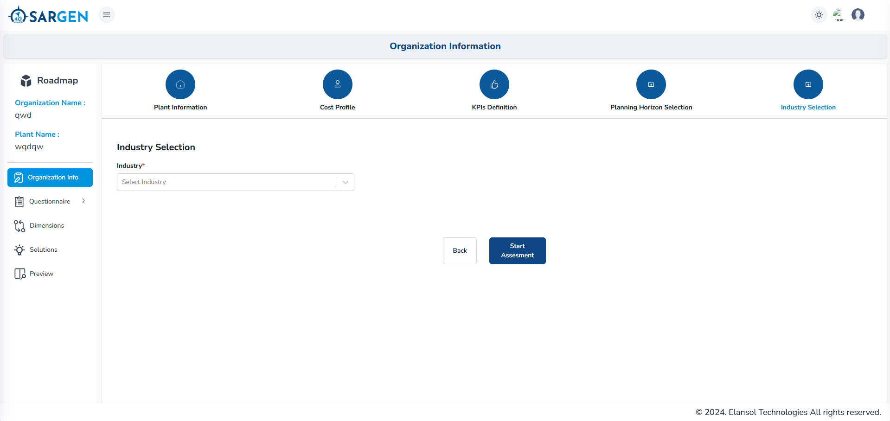
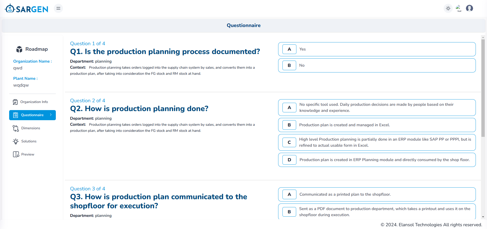

# Application Overview

## 1. Login and User Authentication

- **Description**: Users log into the system using their credentials (e.g., username and password).
- **Outcome**: Upon successful login, users are directed to the dashboard, where they can initiate a new assessment or review past assessments.

---

## 2. Upload Metadata Files

- **Step**: Users must upload key files before beginning the assessment process.
  - **Questionnaire (Excel)**: Contains the questions for the assessment.
  - **Rule Engine (Excel)**: Defines the rules for scoring and assessments.
  - **Dimension Metadata (Excel)**: Contains the list of available dimensions.
  - **Dimension Mapping (Excel)**: Defines how dimensions are mapped based on user responses.
  - **Solution Metadata (Excel)**: Includes possible solutions based on the selected dimensions.
- **Validation**: System validates the file format and contents. If the required files are not uploaded or improperly formatted, an error message is displayed.
- **Outcome**: Once files are successfully uploaded, the user can proceed to the next step.

---

## 3. Input Plant Information and Cost Profile

- **Step**: Users enter details about the plant's operations, location, production capacity, and other key parameters.
- **Cost Profile**: Users input various cost factors such as operational, maintenance, and production costs.
- **Validation**: The system checks the validity of numeric entries and required fields.
- **Outcome**: The plant and cost data are saved for use in the assessment.

---

## 4. Define Key Performance Indicators (KPIs)

- **Step**: Users are presented with a list of available KPIs and are required to select up to 5 KPIs.
  - **Description**: KPIs can include operational efficiency, cost per unit, energy consumption, etc.
- **Validation**: The system ensures that no more than 5 KPIs are selected.
- **Outcome**: The selected KPIs are saved and will be used later for benchmarking in the assessment.

---

## 5. Select Planning Horizon and Industry

- **Planning Horizon Selection**: Users choose a planning horizon from options like short-term (1 year), mid-term (3-5 years), or long-term (10+ years).
  - Multiple checkboxes are available, but users can only select one option.
- **Industry Selection**: Users select an industry from a dropdown list (e.g., Manufacturing, Healthcare, Retail, etc.).
- **Outcome**: Planning horizon and industry are saved for use in the assessment and roadmap generation process.

---

## 6. Start Assessment

- **Step**: After completing the initial setup (plant info, cost profile, KPIs, planning horizon, and industry), the user clicks the "Start Assessment" button to begin.
- **Validation**: The system ensures that all required inputs have been provided before allowing the user to proceed.
- **Outcome**: The assessment questionnaire is loaded and displayed.

---

## 7. Complete Questionnaire

- **Step**: The system displays a series of questions from the uploaded questionnaire. Each question is presented with multiple-choice options (A, B, C, D, F).
- **Answer Selection**: Users select one answer per question. Some questions may require additional input via voice typing or written text.
  - **Voice Input Option**: Users can provide reasoning via voice input, or manually enter text in cases where voice input is not supported.
- **Outcome**: All answers are saved, and the system uses them to calculate assessment results.

---

## 8. Dimension Matching
- **Step**: After completing the questionnaire, the system automatically maps the user’s answers to 16 predefined operational dimensions (such as Efficiency, Cost, Innovation, etc.).
- **Dimension Selection**: Users can review the matched dimensions and select a maximum of 4 dimensions for the next step.
- **Validation**: The system ensures no more than 4 dimensions are selected.
- **Outcome**: The selected dimensions are saved and will be used for solution generation.

---

## 9. Solution Generation
- **Step**: Based on the selected dimensions, the system generates a list of recommended solutions.
- **Solution Display**: Solutions are displayed with detailed descriptions, potential impact, timelines, and associated costs.
- **Outcome**: Users can review and finalize the solutions, which will be used to create the roadmap.

---

## 10. Review and Export Roadmap
- **Step**: The system compiles the assessment results, selected dimensions, and recommended solutions into a detailed roadmap.
- **Roadmap Details**: The roadmap includes strategic actions, timelines, cost estimates, and KPIs for monitoring progress.
- **Export Options**: Users can export the roadmap in various formats such as Word for further analysis or distribution.
- **Outcome**: The roadmap is saved and can be accessed later or shared with stakeholders.
